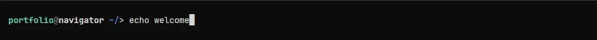

# [Whoami](https://24kingsunite.net)

  

A personal portfolio and technical writing site for project writeups, experiments, and software notes. Articles are written in Markdown and presented through a terminal- and editor-inspired interface.

Built with React, React Router, TypeScript, and Vite.

## Adding a new section

Sections are driven by Markdown. Adding an article to an existing section only requires a new Markdown file; its filename becomes the article slug.

> The easiest way to add a new route is to follow the same convention as `projects/`

To add a new section:

1. Add an ID to `RouteId` in `app/lib/site-catalog.ts`.
2. Create the needed files and folders for routing:
    - Create `app/pages/<section>/route.tsx`. Its `loader` and `clientLoader` should use `import.meta.glob` with a literal pattern such as `"/app/markdown/<section>/*.md"`, then pass the files to `initSection`.
      > Vite expands these globs at build time, so variables and template literals cannot be used for the glob pattern.
    - Create `app/pages/<section>/index.tsx` and `app/pages/<section>/post.tsx`. These render the section list and individual articles.
      > You can reuse the existing `projects` views, changing the `RouteId` and route prefix as needed.

3. Register the parent route, its index route, and its `:slug` child in `app/routes.ts`.
4. Add `app/markdown/<section>/index.md` with the section front matter. This file provides section metadata only; its Markdown body is not rendered.
5. Add article Markdown files beside `index.md`.
    > Each file's front matter provides its card and page metadata; the filename is used as its URL slug.

For example, `app/markdown/<section>/example.md` is available at `/<section>/example.md` after its route is registered.
