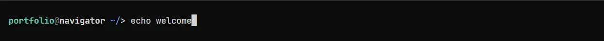

# [Whoami](https://24kingsunite.net)

  

A personal portfolio and technical writing site for project writeups, experiments, and software notes. Articles are written in Markdown and presented through a terminal- and editor-inspired interface.

Built with React, React Router, TypeScript, and Vite.

## Adding content

Content is driven by Markdown under `app/markdown/`. Each file's front matter
supplies its card and page metadata, and its filename becomes the URL slug.

### Adding a page

Drop a `.md` file into `app/markdown/`. Nothing else is required — top-level
pages are routed dynamically. `app/markdown/resume.md` is served at `/resume.md`,
and `app/markdown/index.md` backs the home page.

### Adding an article to an existing section

Add a `.md` file beside the section's `index.md`, e.g.
`app/markdown/projects/example.md` is served at `/projects/example.md`.

### Adding a new section

Sub-level sections are declared explicitly so their routes stay intentional. The
build fails with a clear error if a Markdown directory has an `index.md` but no
matching declaration.

1. Add an entry to `SECTIONS` in `app/lib/sections.ts`.
2. Register the parent route, its index route, and its `:slug` child in
   `app/routes.ts`, reading the path and id from `SECTIONS`.
3. Create `app/pages/<section>/route.tsx` with a `loader`/`clientLoader` calling
   `getSection(SECTIONS.<section>.dir)`, plus `index.tsx` and `post.tsx` views.
   > The existing `projects` views can be reused as-is, swapping the section.
4. Add `app/markdown/<section>/index.md` for the section front matter. Its
   `links` field renders as the symlink entries in the shell navigation.
5. Add article Markdown files beside `index.md`.

## Scripts

| Script | Purpose |
| --- | --- |
| `npm run dev` | Start the dev server |
| `npm run build` | Prerender the static site into `build/` |
| `npm run type-check` | Type-check both TS projects (`tsc -b`) |
| `npm run lint` | Run ESLint |
| `npm run format` | Format with Prettier |
